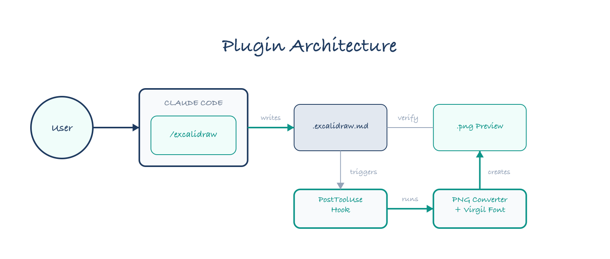
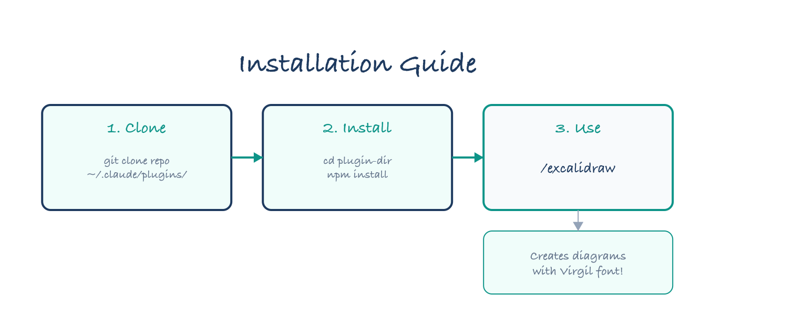
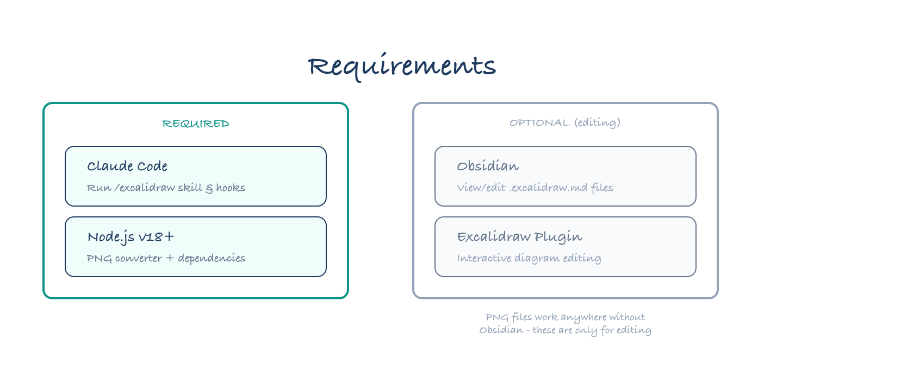

# Excalidraw for Obsidian - Claude Code Plugin

Create professional Excalidraw diagrams directly from Claude Code, with automatic PNG preview generation for iterative refinement.



## Features

- **`/excalidraw` skill** - Generate flow diagrams, architecture charts, and visual documentation
- **Virgil font** - Excalidraw's signature hand-drawn typeface for warm, approachable text
- **Clean shapes** - Professional, precise lines (the "balanced" style)
- **Auto PNG preview** - PostToolUse hook generates PNG whenever you write `.excalidraw.md` files
- **Iterative refinement** - Claude reads the PNG to verify rendering, fixes issues automatically

## Installation



### Step 1: Clone

```bash
git clone https://github.com/fremontcw/excalidraw-obsidian.git ~/.claude/plugins/excalidraw-obsidian
```

### Step 2: Install Dependencies

```bash
cd ~/.claude/plugins/excalidraw-obsidian
npm install
```

### Step 3: Use

In Claude Code, just type:

```
/excalidraw
```

Or ask Claude to create a specific diagram:

```
/excalidraw Create a flow diagram showing: Input → Process → Output
```

## How It Works

1. **You invoke `/excalidraw`** with a description of what you want
2. **Claude generates** an `.excalidraw.md` file with JSON elements
3. **PostToolUse hook triggers** automatically after the file is written
4. **PNG converter runs** with embedded Virgil font
5. **Claude reads the PNG** to verify it looks correct
6. **If issues found**, Claude edits and regenerates

## Diagram Types

| Type | Description |
|------|-------------|
| **Flow Diagram** | Process flows, user journeys, data pipelines |
| **Architecture Diagram** | System components, layers, integrations |
| **Sequence Diagram** | Step-by-step interactions between entities |
| **Concept Map** | Ideas and relationships, brainstorming |
| **Component Diagram** | UI components, module structure |

## Style: Balanced (Hand-drawn Text + Clean Shapes)

The plugin uses a "balanced" style that combines:

- **Virgil font** - Warm, hand-drawn text (the Excalidraw signature look)
- **Clean shapes** - `roughness: 0` for precise, professional lines

This creates diagrams that feel approachable but still technical.

### Color Palette

| Color | Hex | Usage |
|-------|-----|-------|
| Primary (Navy) | `#1e3a5f` | Titles, main borders |
| Accent (Teal) | `#0d9488` | Key sections, highlights |
| Neutral Dark | `#64748b` | Secondary elements |
| Neutral Light | `#94a3b8` | Tertiary elements |
| Background Light | `#f8fafc` | Element backgrounds |
| Background Accent | `#f0fdfa` | Highlighted sections |

## Requirements



### Required

| Requirement | Purpose |
|-------------|---------|
| **Claude Code** | Run the `/excalidraw` skill and PostToolUse hooks |
| **Node.js** (v18+) | Run the PNG converter script |

### Optional (for editing diagrams)

| Requirement | Purpose |
|-------------|---------|
| **[Obsidian](https://obsidian.md)** | View and edit `.excalidraw.md` files |
| **[Excalidraw plugin](https://github.com/zsviczian/obsidian-excalidraw-plugin)** | Enable Excalidraw editing mode in Obsidian |

> **Note:** You don't need Obsidian to use this plugin! The PNG files work anywhere. Obsidian + Excalidraw plugin are only needed if you want to manually edit the diagrams or use them in your Obsidian vault.

## Dependencies

### npm Packages

| Package | Purpose |
|---------|---------|
| [lz-string](https://www.npmjs.com/package/lz-string) | Decompress Obsidian's LZ-String compressed Excalidraw JSON |
| [sharp](https://www.npmjs.com/package/sharp) | Convert SVG to PNG with high quality rendering |

These are installed automatically when you run `npm install`.

### Bundled Assets

| Asset | Purpose |
|-------|---------|
| `Virgil.woff2` | Excalidraw's hand-drawn font (OFL-1.1 license) |

## File Structure

```
excalidraw-obsidian/
├── plugin.json          # Plugin manifest
├── package.json         # Node.js dependencies
├── README.md            # This file
├── skills/
│   └── excalidraw.md    # The /excalidraw skill
├── hooks/
│   └── excalidraw-to-png.sh  # PostToolUse hook
├── scripts/
│   ├── excalidraw-to-png.js  # PNG converter
│   └── Virgil.woff2          # Hand-drawn font
└── docs/
    ├── install-guide.excalidraw.md
    ├── install-guide.png
    ├── architecture.excalidraw.md
    └── architecture.png
```

## Manual PNG Generation

```bash
node scripts/excalidraw-to-png.js <file.excalidraw.md> [output.png]
```

Options:
- `--save-svg` - Also save intermediate SVG
- `--padding=N` - Padding around content (default: 40)
- `--bg=COLOR` - Background color (default: #ffffff)

## Output Format

Creates `.excalidraw.md` files compatible with the [Obsidian Excalidraw plugin](https://github.com/zsviczian/obsidian-excalidraw-plugin).

To view in Obsidian:
1. Open the `.excalidraw.md` file
2. Click "More Options" (⋮)
3. Select "Switch to Excalidraw View"

## Credits

- [Virgil font](https://github.com/excalidraw/virgil) by Ellinor Rapp (OFL-1.1 license)
- [Excalidraw](https://excalidraw.com) for the inspiration

## License

MIT
